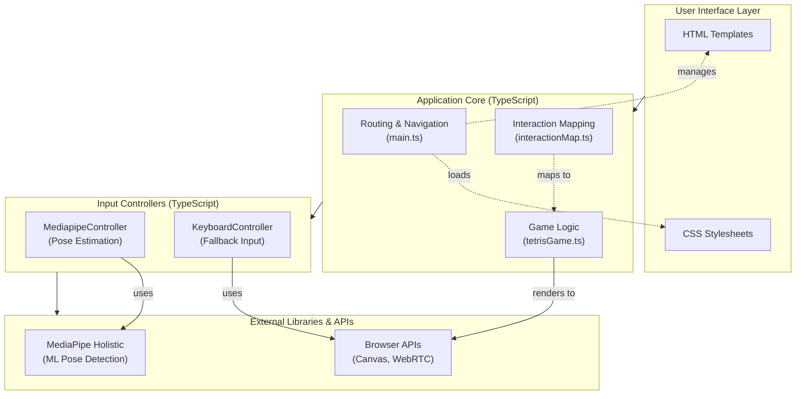
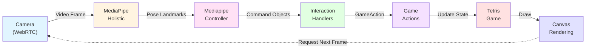

# Implementation

## Overview

BodyBlocks is a web-based gesture-controlled Tetris game that leverages computer vision and pose estimation to enable full-body interaction. The application is built as a modern Single-Page Application (SPA) using TypeScript and is deployed as a static web application. This chapter describes the technical architecture, key components, libraries and tools used, and their interplay.

## Technical Architecture

The application follows a modular architecture with clear separation of concerns:

## Core Technical Components

### 1. Build System and Development Environment

**Vite** serves as the build tool and development server, providing:
- Fast Hot Module Replacement (HMR) during development
- Optimized production builds with code splitting
- Native ES module support
- TypeScript compilation through integration with the TypeScript compiler

**TypeScript** (v5.9.3) provides static typing with strict compilation settings:
- Type safety across all modules
- Enhanced IDE support and autocompletion
- Reduced runtime errors through compile-time checks
- Configuration targeting ES2022 with DOM APIs

### 2. Computer Vision and Pose Estimation

**MediaPipe Holistic** (v0.5.1675471629) is the core machine learning library:
- Real-time pose landmark detection (33 body keypoints)
- Face and hand landmark detection (468 face, 21 per hand)
- Runs efficiently in the browser using WebAssembly and WebGL
- Provides normalized 3D coordinates (x, y, z) for each landmark

**MediaPipe Camera Utils** (v0.3.1675466862) manages webcam integration:
- Abstracts WebRTC camera access
- Handles video frame capture and preprocessing
- Manages frame rate and resolution settings (640×480)

### 3. Application Core Components

#### Routing System (`main.ts`)
A custom client-side router handles navigation without page reloads:
- Uses Vite's `import.meta.glob` to bundle HTML templates
- Dynamically loads page-specific scripts and styles
- Parses URL paths and query parameters
- Manages document head elements (title, scripts, stylesheets)

#### MediapipeController (`mediapipeController.ts`)
Bridges raw pose landmarks to game commands:
- Processes 33 pose landmarks from MediaPipe Holistic
- Implements gesture recognition algorithms for body movements
- Applies smoothing and debouncing to reduce noise
- Emits high-level commands (e.g., `hipLeft`, `squat`, `bothHandsUp`)

**Key gesture detection algorithms:**
- **Hip movement**: Tracks center point between hip landmarks, applies exponential smoothing (α=0.2), detects lateral movement beyond threshold (±0.12 normalized units)
- **Squat detection**: Combines hip vertical displacement with knee angle computation (using dot product of vectors), requires sustained detection (300ms) before state change
- **Hand raises**: Compares wrist Y-coordinate to shoulder Y-coordinate with threshold
- **Lean detection**: Measures shoulder Y-coordinate difference relative to shoulder width

#### Interaction Mapping (`interactionMap.ts`)
Translates body gestures to game actions:
- Maps interaction IDs (e.g., 'lean', 'raise-hand', 'squat') to input categories ('movement', 'rotation', 'drop')
- Provides pluggable handler system for custom gesture mappings
- Converts abstract commands to concrete game actions (`move`, `rotate`, `drop`)

#### Tetris Game Engine (`tetrisGame.ts`)
Implements classic Tetris mechanics:
- 10×20 grid with seven tetromino shapes (I, J, L, O, S, T, Z)
- Collision detection and piece locking
- Line clearing with animated fade-out (400ms duration)
- Score calculation following standard Tetris rules
- Ghost piece preview for target positioning
- Soft drop and hard drop mechanics

**Rendering:** Uses HTML5 Canvas 2D context for efficient grid and piece rendering with color-coded tetrominoes.

#### Keyboard Controller (`keyboardController.ts`)
Provides traditional keyboard controls as fallback:
- Maps arrow keys to game movements
- Handles rotation (Z/X keys) and drops (Space, Down arrow)
- Enables accessibility and testing without camera

### 4. User Interface Pages

The application uses a multi-page structure with five main views:

1. **Start Page** (`start.html`): Landing page with navigation to training or game mode
2. **Select Training** (`select-training.html`): Interface for choosing interaction types to practice
3. **Execute Training** (`execute-training.html`): Training environment with visual feedback
4. **Choose Combination** (`choose-combination.html`): Selection interface for assigning gestures to game actions
5. **Gameplay** (`gameplay.html`): Main game view with webcam feed, pose overlay, and game canvas

Each page includes its own HTML template, TypeScript module, and CSS stylesheet, loaded dynamically by the routing system.

## Data Flow and Component Interplay

### Gameplay Loop

**Step-by-step data flow:**

1. **Video Capture**: Camera Utils captures webcam frames at ~30 FPS
2. **Pose Inference**: MediaPipe Holistic processes each frame, outputting 33 pose landmarks with (x, y, z, visibility) coordinates
3. **Gesture Recognition**: MediapipeController analyzes landmark positions to detect gestures (e.g., squat = hip drop + knee bend)
4. **Command Emission**: Controller emits `Command` objects containing boolean flags and numeric values
5. **Interaction Mapping**: Selected interaction handlers convert commands to `GameAction` objects
6. **Game Update**: TetrisGame receives actions and updates piece position, rotation, or triggers drop
7. **Rendering**: Game renders current state to canvas (grid, active piece, ghost piece, score)
8. **Visualization**: Pose landmarks optionally drawn on overlay canvas for user feedback

### Configuration and State Management

- **localStorage**: Persists user-selected interaction combinations between sessions
- **URL Parameters**: Encodes page-specific configuration (e.g., training mode settings)
- **Object References**: Game and controller instances shared between modules through constructor injection

### Asset Loading Strategy

**Development Mode:**
- MediaPipe WASM/model files served from `/node_modules/@mediapipe/holistic/`
- Hot reload for rapid iteration

**Production Mode:**
- MediaPipe assets loaded from jsDelivr CDN for reliability and performance
- Vite bundles application code and templates into optimized chunks
- Static assets (images, GIFs) served from `/public` directory

## Libraries and Tools Summary

| Component | Library/Tool | Version | Purpose |
|-----------|-------------|---------|---------|
| Build System | Vite | 7.2.4 | Development server and production bundler |
| Language | TypeScript | 5.9.3 | Type-safe application code |
| Pose Estimation | MediaPipe Holistic | 0.5.x | Real-time body tracking |
| Camera Access | MediaPipe Camera Utils | 0.3.x | Webcam integration |
| Rendering | HTML5 Canvas API | - | Game graphics |
| Video | WebRTC getUserMedia | - | Camera stream |

### Deployment

The application is deployed as a static site on **Cloudflare Pages**:
- Build command: `npm run build` (runs TypeScript compiler + Vite bundler)
- Output directory: `dist`
- Automatic deployments from Git repository
- Global CDN distribution for low latency

## Technical Decisions and Rationale

**Browser-Based Architecture**: Eliminates installation barriers, enables cross-platform support, and leverages modern web APIs for camera access and real-time graphics.

**TypeScript**: Provides type safety critical for complex state management and reduces bugs in gesture recognition logic.

**MediaPipe**: Offers state-of-the-art pose estimation with efficient on-device inference, avoiding server round-trips and privacy concerns.

**Vite**: Delivers fast development experience with instant HMR and optimized production builds through modern bundling techniques.

**Canvas Rendering**: Provides sufficient performance for 60 FPS game rendering with full control over pixel-level drawing.

**Modular Controller Design**: Separates gesture recognition from game logic, enabling easy addition of new interaction types and alternative input methods (e.g., keyboard fallback).

## Performance Characteristics

- **Pose Inference**: ~30 FPS on modern hardware (GPU-accelerated)
- **Game Rendering**: 60 FPS (synchronized with requestAnimationFrame)
- **Input Latency**: ~100-150ms from gesture to game response (including processing and debouncing)
- **Bundle Size**: ~200 KB gzipped (excluding MediaPipe models loaded from CDN)

## Extensibility

The architecture supports extension through:
- **Custom Gestures**: Register new handlers in `interactionMap.ts`
- **New Game Mechanics**: Extend `TetrisGame` class methods
- **Alternative ML Models**: Replace MediapipeController with different pose estimation backends
- **Additional Pages**: Add new HTML templates and route handlers in routing system
